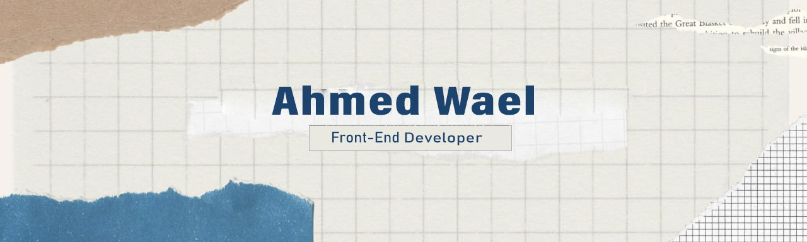

<!--The Header Photo -->


<!--The Gif Image which is in the right -->


### 🤔 About
-  **Working :** Front-End :computer: 
-  **Learning :** React JS :zap:	
-  **Hobbies :** Reading :books: | Music :headphones:
-  **Ask me about :** Anything!, I'm happy to help :v:
 
```JavaScript
console.log("Error 404 ❗🥹")
```
-----------------------------------------------------------------------------------------------------------------------------------------------------------------------
### 🧑‍💻 Tools & Technologies
<p align=left>
 
 

 
 

 </p>
 
 <p align=left>


</p>

-----------------------------------------------------------------------------------------------------------------------------------------------------------------------
### ✨ Visitors count

<p align="center">
  
</p>

 <p align="center">
  
</p>  
  
-----------------------------------------------------------------------------------------------------------------------------------------------------------------------

<p align="center">
<a href="https://twitter.com/A7madwael29" target="blank">
  
</a>
  
<a href="https://www.linkedin.com/in/ahmed-wael-91929b224/" target="blank">
  
</a>
<a href="https://web.facebook.com/profile.php?id=100006697871359" target="blank">
  
</a>
</p>

<p align="center"><em><b>I love connecting with different people</b> so if you want to say <b>Hi 👋, I'll be happy to meet you more!</b> :)</em></p>

-----------------------------------------------------------------------------------------------------------------------------------------------------------------------
